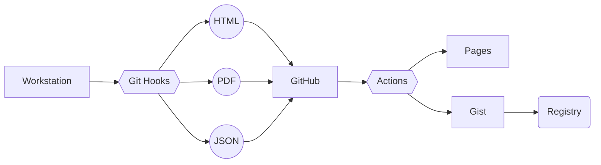

# 🐧 [weshenderson.info](https://weshenderson.info)
[](https://github.com/weshenderson/weshenderson.github.io/actions/workflows/resume.yml) [](https://github.com/weshenderson/weshenderson.github.io/actions/workflows/pylint.yml) [](https://github.com/weshenderson/weshenderson.github.io/actions/workflows/pages/pages-build-deployment)

The personal webpage of Wes Henderson.

[](https://weshenderson.info/resumes/resume)

## Layout
This site is powered by [Alea](https://github.com/necrux/alea) and hosted with GitHub Pages. Alea is the templating engine that creates `index.html` and `resume.html` based off of their respective yaml config files. All resume versions are generated from `configs/resume.yaml`, which is fully compliant with the [JSON Resume](https://jsonresume.org/) 1.0.0 spec.

## Workflow



1. A change is made to `configs/resume.yaml`.
2. A [pre-commit hook](https://github.com/weshenderson/weshenderson.github.io/blob/main/.hooks/pre-commit) is executed which generates the following versions of the resume:
   * `resume.json` *(JSON)*
   * `resume.html` *(HTML)*
   * `resume.pdf` *(PDF)*
3. The changes are pushed to GitHub.
4. The following GitHub Actions are ran:
   * [PyLint](https://github.com/weshenderson/weshenderson.github.io/actions/workflows/pylint.yml): Lints my code.
   * [Update Resume Gist](https://github.com/weshenderson/weshenderson.github.io/actions/workflows/resume.yml): Uploads `configs/resume.json` to a public [gist](https://gist.github.com/necrux/47c721cc5ac327c7acc1654fb822005b).
   * [pages-build-deployment](https://github.com/weshenderson/weshenderson.github.io/actions/workflows/pages/pages-build-deployment): Builds and deploys my GitHub Page.
5. The JSON Resume registry is updated with my [new resume](https://registry.jsonresume.org/necrux).
6. My [GitHub Page](https://www.weshenderson.info/) is updated with my new content/resume.

## Hooks
This repo relies heavily on pre-commit hooks to auto-generate new resources whenever certain files are updated. This is especially important for my resume as I would have to maintain 4 versions otherwise. The hooks (and Actions) allow me to effectively separate the content from the format!

**PDF Resume**

The PDF version of my resume is generated via Google Chrome dev tools:

```
/usr/bin/google-chrome \
            --headless \
            --disable-gpu \
            --no-pdf-header-footer \
            --no-margins \
            --run-all-compositor-stages-before-draw \
            --print-to-pdf=${PDF} \
            file://${BASE_PATH}/${TMP}
```

Previously this work was done via Pandoc, however this results in a prettier end product without having to create LateX templates since Chrome is able to render the underlying CSS.


### Hooks and Easter Eggs
I am using Javascript and data attributes to toggle the CSS layout in order to give the resume a retro vibe. To view this version simply enter the Konami Code on [/resume](https://www.weshenderson.info/resumes/resume):

```
up, up, down, down, left, right, left, right, b, a
```

## ChatGPT Integration
These URLs are integrated with OpenAI's ChatGPT; they will pass my resume to ChatGPT with a predefined prompt to get a new response generated each time. They can take 10 seconds (or more) to run.

**Cover Letter**

This endpoint attempts to write a cover letter that matches my resume:
* https://registry.jsonresume.org/necrux/letter

**Resume Suggestions**

This endpoint asks ChatGPT to provide feedback and suggest improvements:
* https://registry.jsonresume.org/necrux/suggestions
