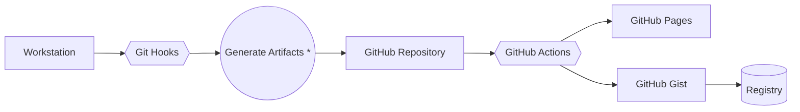

# 🐧 [weshenderson.info](https://weshenderson.info)
[](https://github.com/weshenderson/weshenderson.github.io/actions/workflows/resume.yml) [](https://github.com/weshenderson/weshenderson.github.io/actions/workflows/pylint.yml) [](https://github.com/weshenderson/weshenderson.github.io/actions/workflows/pages/pages-build-deployment)

The personal webpage of Wes Henderson.

## Layout
This site is powered by [Alea](https://github.com/weshenderson/weshenderson.github.io/blob/main/alea.py) and hosted with GitHub Pages. Alea is the templating engine that creates `index.html` and `resume.html` based off of their respective yaml config files. All resume versions are generated from `configs/resume.yaml`, which is fully compatible with the [JSON Resume](https://jsonresume.org/) 1.0.0 spec.

## Workflow


```mermaid
flowchart LR
    A[Workstation] --> B{{Git Hooks}}

    B --> D((Generate Artifacts *))

    D --> F[GitHub Repository]

    F --> G{{GitHub Actions}}

    G --> H[GitHub Pages]
    G --> I[GitHub Gist]

    I --> J[(Registry)]
```
\* *Generate Artifacts: HTML, JSON, PDF, Markdown, and DOCX.*

1. A change is made to `configs/resume.yaml`.
2. A [pre-commit hook](https://github.com/weshenderson/weshenderson.github.io/blob/main/.hooks/pre-commit) is executed which generates the following artifacts:
   * `resume.json` *(JSON)*
   * `resume.html` *(HTML)*
   * `resume.pdf` *(PDF)*
   * `resume.md` *(markdown)*
   * `resume.docx` *(DOCX)*
3. Changes are pushed to GitHub.
4. The following GitHub Actions run:
   * [PyLint](https://github.com/weshenderson/weshenderson.github.io/actions/workflows/pylint.yml): Lints my code.
   * [Update Resume Gist](https://github.com/weshenderson/weshenderson.github.io/actions/workflows/resume.yml): Uploads `configs/resume.json` to a public [gist](https://gist.github.com/necrux/47c721cc5ac327c7acc1654fb822005b).
   * [pages-build-deployment](https://github.com/weshenderson/weshenderson.github.io/actions/workflows/pages/pages-build-deployment): Builds and deploys my GitHub Page.
5. The JSON Resume registry is updated with my [new resume](https://registry.jsonresume.org/necrux).
6. My [GitHub Page](https://www.weshenderson.info/) is updated with my new content/resume.

## Hooks
This repo relies heavily on pre-commit hooks to auto-generate new resources whenever certain files are updated. This is especially important for my resume as I would have to maintain 4 versions otherwise. The hooks (and Actions) allow me to effectively separate the content from the presentation!

**PDF Resume**

The PDF version of my resume is generated via `chrome-headless-shell`. The old headless browser no longer ships with the default Google Chrome dev tools within Chrome as it a separate binary and an entirely different browser. You can read more about these changes [here](https://developer.chrome.com/docs/chromium/headless).

I have built the new `chrome-headless-shell` as a dockerfile for portability. Simply run `docker-compose` up after exporting the `TMP` and `OUTPUT` variables.

```
/chrome-headless
    --no-sandbox
    --headless
    --disable-gpu
    --no-pdf-header-footer
    --no-margins
    --run-all-compositor-stages-before-draw
    --print-to-pdf=${OUTPUT}
    ${TMP}
```

Previously this work was done via Pandoc, however this results in a prettier end product without having to create LateX templates since Chrome is able to render the underlying CSS.


### Hooks and Easter Eggs
I am using Javascript and data attributes to toggle the CSS layout in order to give the resume a retro vibe. To view this version simply enter the Konami Code on [/resume](https://www.weshenderson.info/resumes/resume):

```
up, up, down, down, left, right, left, right, b, a, <enter>
```
