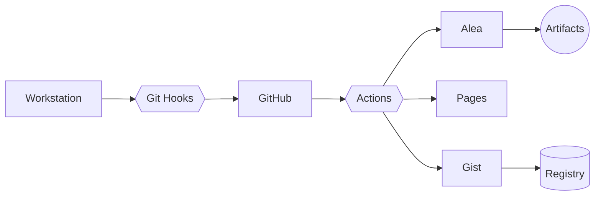

# 🐧 [weshenderson.info](https://weshenderson.info)

The personal webpage of Wes Henderson.

* [](https://github.com/weshenderson/weshenderson.github.io/actions/workflows/pylint.yml)
* [](https://github.com/weshenderson/weshenderson.github.io/actions/workflows/alea.yml)
* [](https://github.com/weshenderson/weshenderson.github.io/actions/workflows/gist.yml)
* [](https://github.com/weshenderson/weshenderson.github.io/actions/workflows/pages/pages-build-deployment)

## Layout
This site and résumé are powered by [Alea](https://github.com/weshenderson/weshenderson.github.io/blob/main/alea.py) and hosted with GitHub Pages. Alea handles the data transformation and artifact generation for both the website and résumé, using separate canonical YAML data sources for each. You can read more about this project [here](https://www.necrux.com/cv/).

All artifacts are generated automatically through GitHub Actions.

> [!NOTE]
The résumé data source is fully compatible with the [JSON Resume](https://jsonresume.org/) 1.0.0 specification.

## Workflow


```mermaid
flowchart LR
    A[Workstation] --> B{{Git Hooks}}

    B --> C[GitHub]

    C --> D{{Actions}}

    D --> E[Alea]
    D --> F[Pages]
    D --> G[Gist]

    E --> H((Artifacts))
    G --> I[(Registry)]
```

1. A change is made to `configs/` or `/templates/`.
2. A [pre-commit hook](https://github.com/weshenderson/weshenderson.github.io/blob/main/.hooks/pre-commit) lints the codes and validates the schemas.
3. Changes are pushed to GitHub.
4. GitHub Actions work their magic:
   * [PyLint](https://github.com/weshenderson/weshenderson.github.io/actions/workflows/pylint.yml): Classic *(and sometimes annoying)* Python linter.
   * [Gist](https://github.com/weshenderson/weshenderson.github.io/actions/workflows/gist.yml): Uploads `configs/resume.json` to a public [gist](https://gist.github.com/necrux/47c721cc5ac327c7acc1654fb822005b).
   * [Pages](https://github.com/weshenderson/weshenderson.github.io/actions/workflows/pages/pages-build-deployment): Builds and deploys my GitHub Page.
   * [Alea](https://github.com/weshenderson/weshenderson.github.io/blob/main/.github/workflows/alea.yml): Generates the following artifacts.
        * `index.html` / `main.css`
        * `resume.json` *(JSON)*
        * `resume.html` *(HTML)*
        * `resume.pdf` *(PDF)*
        * `resume.md` *(markdown)*
        * `resume.docx` *(DOCX)*

## Post Deployment
Once deployed the website and various résumé formats can be found below:

* [Personal Website](https://www.weshenderson.info/)
* [HTML Résumé](https://www.weshenderson.info/resumes/resume.html)
* [PDF Résumé](https://www.weshenderson.info/resumes/resume.pdf)
* [DOCX Résumé](https://www.weshenderson.info/resumes/resume.docx)
* [Markdown Résumé](https://github.com/weshenderson/weshenderson.github.io/blob/main/resumes/resume.md)
* [JSON Registry](https://registry.jsonresume.org/necrux)

## Artifacts
All artifacts, other than PDFs, are generated with Alea from a canonical data source. Separating the presentation from the data means that I can maintain many versions and formats without having to alter the underlying data!

**PDF Resume**

The PDF version of my resume is generated via `chrome-headless-shell`. The old headless browser no longer ships with the default Google Chrome dev tools within Chrome as it a separate binary and an entirely different browser. You can read more about these changes [here](https://developer.chrome.com/docs/chromium/headless).

I have built the new `chrome-headless-shell` as a dockerfile for portability. Simply run `docker-compose` up after exporting the `TMP` and `OUTPUT` variables.

> [!TIP]
During the build process these variables are set with the [.build.parameters](
https://github.com/weshenderson/weshenderson.github.io/blob/main/.build.parameters) file.

```
/chrome-headless
    --no-sandbox
    --headless
    --disable-gpu
    --no-pdf-header-footer
    --no-margins
    --run-all-compositor-stages-before-draw
    --print-to-pdf=${OUTPUT}
    ${TMP}
```
> [!NOTE]
Previously this work was done via Pandoc, however this results in a prettier end product without having to create LateX templates since Chrome is able to render the underlying CSS.

### Easter Eggs
I am using Javascript and data attributes to toggle the CSS layout in order to give the resume a retro vibe. To view this version simply enter the Konami Code on [/resume](https://www.weshenderson.info/resumes/resume):

```
^ ^ v v < > < > B A ENTER
```

This was a hard requirement of my project from the beginning. I still cannot tell you why, it just felt right!
