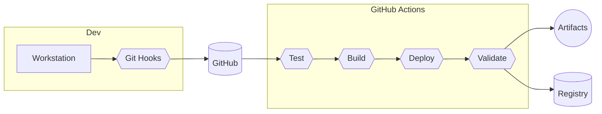

# 🐧 [weshenderson.info](https://weshenderson.info)

Hey, I'm Wes. This is my personal corner of the web, where I keep my résumé, projects, and a few things I've built along the way. What started as a simple personal webpage has grown into a small, automated project that reflects how I like to build things.

## Architecture
This site and résumé are powered by [Alea](https://github.com/weshenderson/weshenderson.github.io/blob/main/alea.py) and hosted with GitHub Pages.

Alea handles the data transformation and artifact generation for both the website and résumé, using separate canonical YAML data sources for each.

The goal is to maintain the résumé and website as data rather than manually maintaining each output format.

You can read more about this project [here](https://www.necrux.com/cv/).

All artifacts are generated automatically through GitHub Actions.

> [!NOTE]
The résumé data source is fully compatible with the [JSON Resume](https://jsonresume.org/) and is validated against version 1.3.1 of the schema.

## Build Validation & Health Dashboard

| Category                  | Check               | Source           |
| ------------------------- | ------------------- | ---------------- |
|  **External Monitoring** | UptimeRobot       |  |
| **Configuration**         | Resume YAML Schema  | [](https://github.com/weshenderson/weshenderson.github.io/actions/workflows/1_test.yml)     |
|                           | Website YAML Schema | [](https://github.com/weshenderson/weshenderson.github.io/actions/workflows/1_test.yml)     |
| **Code Quality**          | PyLint              | [](https://github.com/weshenderson/weshenderson.github.io/actions/workflows/1_test.yml)     |
| **Compatibility**         | JSON Resume Schema  | [](https://github.com/weshenderson/weshenderson.github.io/actions/workflows/1_test.yml)    |
| **Artifact Validation**   | Website             | [](https://github.com/weshenderson/weshenderson.github.io/actions/workflows/2_build.yml)    |
|                           | HTML                | [](https://github.com/weshenderson/weshenderson.github.io/actions/workflows/2_build.yml)    |
|                           | Markdown            | [](https://github.com/weshenderson/weshenderson.github.io/actions/workflows/2_build.yml)    |
|                           | CSS                 | [](https://github.com/weshenderson/weshenderson.github.io/actions/workflows/2_build.yml)    |
|                           | PDF                 | [](https://github.com/weshenderson/weshenderson.github.io/actions/workflows/2_build.yml)    |
|                           | DOCX                | [](https://github.com/weshenderson/weshenderson.github.io/actions/workflows/2_build.yml)    |
| **Build Integrity**       | Required Files      | [](https://github.com/weshenderson/weshenderson.github.io/actions/workflows/2_build.yml)    |
|                           | Build Provenance      | [](https://github.com/weshenderson/weshenderson.github.io/actions/workflows/2_build.yml)    |
| **Deployment**            | GitHub Pages        | [](https://github.com/weshenderson/weshenderson.github.io/actions/workflows/3_deploy.yml)   |
|               | JSON Resume Gist   | [](https://github.com/weshenderson/weshenderson.github.io/actions/workflows/3_deploy.yml)   |
| **Production Validation** | Deployed Files      | [](https://github.com/weshenderson/weshenderson.github.io/actions/workflows/4_validate.yml) |
|                           | Deployed Provenance   | [](https://github.com/weshenderson/weshenderson.github.io/actions/workflows/4_validate.yml) |
|                           | Website Links       | [](https://github.com/weshenderson/weshenderson.github.io/actions/workflows/4_validate.yml) |
|                           | Resume Links        | [](https://github.com/weshenderson/weshenderson.github.io/actions/workflows/4_validate.yml) |

## Workflow


```mermaid
flowchart LR
    subgraph Dev
      A[Workstation] --> B{{Git Hooks}}
    end

    B --> C[(GitHub)]
    C --> D{{Test}}

    subgraph GitHub Actions
      D --> E{{Build}}
      E --> F{{Deploy}}
      F --> G{{Validate}}
    end

    G --> J((Artifacts))
    G --> K[(Registry)]
```

1. A change is made to `configs/` or `/templates/`.
2. A [pre-commit hook](https://github.com/weshenderson/weshenderson.github.io/blob/main/.hooks/pre-commit) Lints the codes and validates the schemas.
3. Changes are pushed to GitHub.
4. GitHub Actions work their magic:
    * [Test](https://github.com/weshenderson/weshenderson.github.io/actions/workflows/1_test.yml): Code linter and schema validations.
    * [Build](https://github.com/weshenderson/weshenderson.github.io/actions/workflows/2_build.yml): Generates artifacts and injects build metadata. Artifacts generated:
        * `index.html` / `main.css`
        * `resume.json`
        * `resume.html`
        * `resume.md`
        * `resume.docx`
        * `resume.pdf`
    * [Deploy](https://github.com/weshenderson/weshenderson.github.io/actions/workflows/3_deploy.yml): Deploys GitHub Pages and updates the JSON gist used by the JSON Resume registry.
    * [Validate](https://github.com/weshenderson/weshenderson.github.io/actions/workflows/4_validate.yml): Validates the deployed artifacts.

## Deployment
Once deployed the website and various résumé formats can be found below:

* [Personal Website](https://www.weshenderson.info/)
* [HTML Résumé](https://www.weshenderson.info/resumes/resume.html)
* [PDF Résumé](https://www.weshenderson.info/resumes/resume.pdf)
* [DOCX Résumé](https://www.weshenderson.info/resumes/resume.docx)
* [Markdown Résumé](https://github.com/weshenderson/weshenderson.github.io/blob/main/resumes/resume.md)
* [JSON Registry](https://registry.jsonresume.org/necrux)

## Artifacts

All artifacts are generated with Alea from canonical data sources. This allows the same underlying data to be rendered into multiple formats without maintaining each format independently.

**PDF Résumé**

The PDF résumé is generated from the HTML résumé using [`chrome-headless-shell`](https://developer.chrome.com/docs/chromium/headless). I package the renderer in Docker to keep PDF generation portable and reproducible.

> [!TIP]
During the build process these variables are set with the [.env](
https://github.com/weshenderson/weshenderson.github.io/blob/main/docker/pdf_resume/.env) file.

```
/chrome-headless
    --no-sandbox
    --headless
    --disable-gpu
    --no-pdf-header-footer
    --no-margins
    --run-all-compositor-stages-before-draw
    --print-to-pdf=${OUTPUT}
    ${TMP}
```
> [!NOTE]
Previously, this was done via Pandoc. Using Chrome instead produces a prettier end product without requiring separate LaTeX templates since Chrome can render the underlying CSS directly.

**DOCX Résumé**

While the PDF résumé is designed to remain visually consistent with the HTML version, the DOCX version intentionally uses simpler formatting and a single-column layout. This makes the document easier for Applicant Tracking Systems (ATS) to parse and import reliably.


## Data Provenance

All generated artifacts include build provenance added by GitHub Actions. The injected metadata provides a provenance trail that links an artifact to the specific Alea build, GitHub Actions run, commit, and date on which it was generated.

When the artifact format allows, the metadata is added as a comment:

```
<!--
Alea Build Information
Build:   42
Run ID:  33448207686
Attempt: 1
Commit:  340d58fcc718622b2f7906bde3f57f97265d575c
Date:    2026-01-01 12:00:00 AM CST
-->
```

Otherwise the metadata is added to a suitable metadata field using the canonical JSON structure.

```
"meta": {
    "buildData": {
        "Build": "42",
        "Run ID": "33448207686",
        "Attempt": "1",
        "Commit": "340d58fcc718622b2f7906bde3f57f97265d575c",
        "Date": "2026-01-01 12:00:00 AM CST"
    }
}
```

> [!NOTE]
`DOCX` is using the 'comments' field and `PDF` is using the 'keywords' field. If you do not have Word or Adobe, the metadata fields can be viewed using scripts in the [tools](tools/) directory.

### Easter Eggs
I am using Javascript and data attributes to toggle the CSS layout in order to give the resume a retro vibe. To view this version simply enter the Konami Code on [/resume](https://www.weshenderson.info/resumes/resume):

```
up, up, down, down, left, right, left, right, B, A
```
